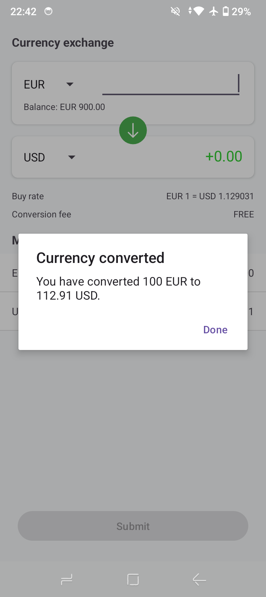
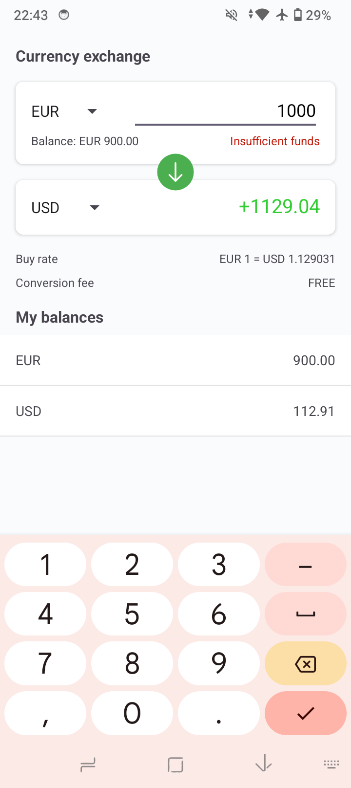
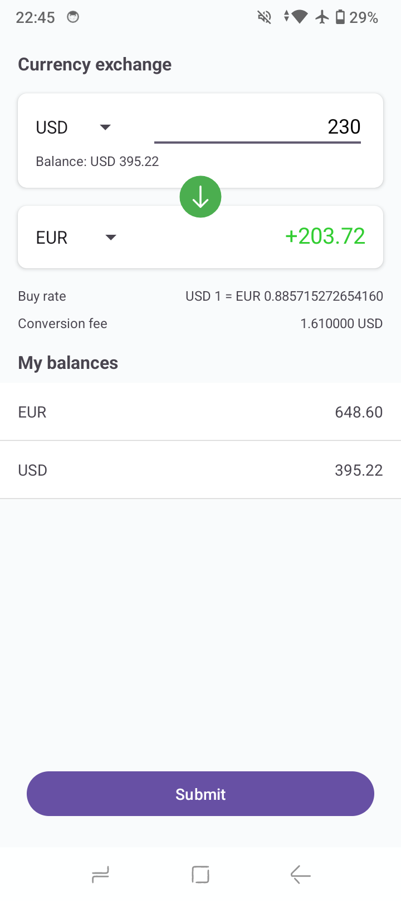

# CurrencyExchange-Demo-Android

Demo Android application written in Kotlin that allows user to do currency exchanges within his multi-currency account. Certain commissions applicable to transaction.

## Deployment

Just clone, build and run as common Android app

## Screenshots
|

|
